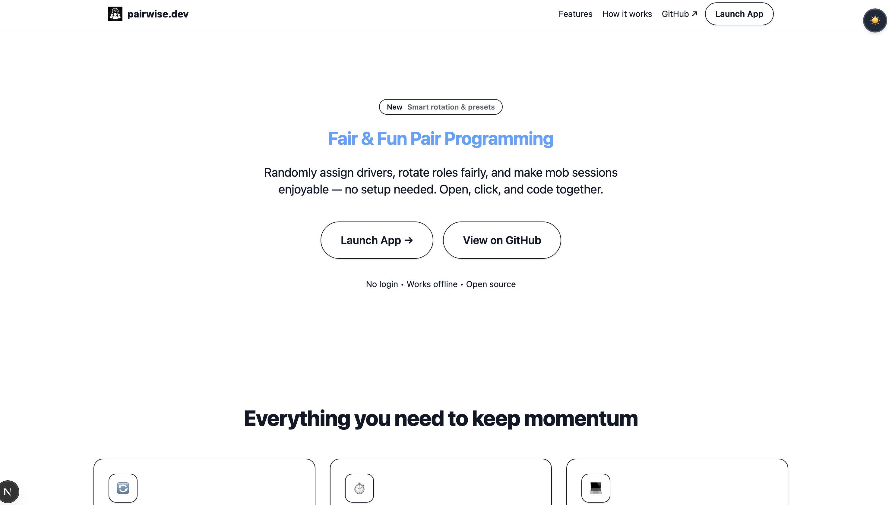
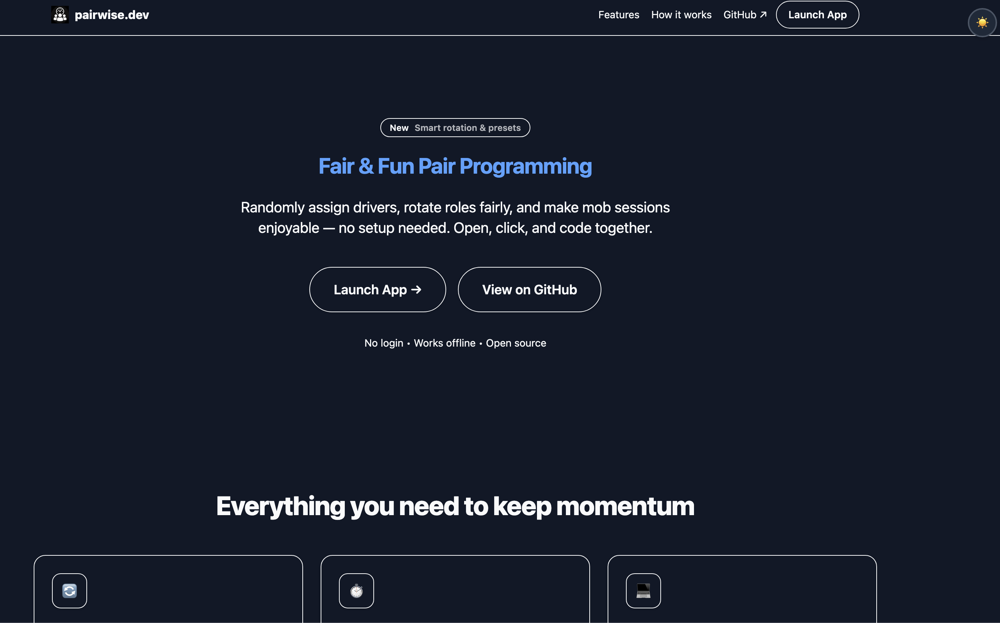

# 🤝 Mob Programming Timer – Fair & Fun Pairing

> **A lightweight, delightful tool to rotate roles fairly during mob or pair programming sessions.**
>
> No accounts. No backend. Just open and go: [👉 Launch the App](https://mob-timer.vercel.app/)

  
  

*Simple, focused, and built for real teams.*

## ✨ Features

- 🔁 **Smart Rotation** – Avoids repeat drivers and fairly cycles through your team.
- ⏱️ **Preset Timers** – Choose 5, 10, 15, or 20-minute intervals with optional sounds and confetti.
- 🧩 **Zero Setup** – Open in any browser. No login, no install, no config needed.
- 👀 **Clear Visual Queue** – See who’s driving, who’s next, and time remaining at a glance.
- 🛠️ **On-the-fly Tweaks** – Change timer duration anytime — next rotation uses new settings.
- 🔒 **Privacy-Friendly** – Everything runs locally in your browser. No tracking. No data leaves your device.

## 🚀 How It Works (3 Steps)

1. **Select Participants**  
   Tick the engineers joining today from your saved roster.

2. **Pick a Timer Preset**  
   Choose 5 / 10 / 15 / 20 minutes — or customize as you go.

3. **Click Start**  
   The app randomizes roles, starts the countdown, and auto-rotates when time’s up!

> “We shaved minutes off every rotation and kept the energy high. The team actually *asks* to use it now.”

## 🔗 Live Demo

👉 **[Try it now: https://mob-timer.vercel.app/](https://mob-timer.vercel.app/)**

Works on laptops, tablets, and phones. Perfect for remote or in-person sessions.

## 💡 Why Use This?

Mob programming thrives on fairness and momentum. This tool:

- Removes bias in role selection
- Keeps sessions time-boxed and focused
- Adds a touch of fun (confetti!) without distraction
- Respects your team’s privacy

## 📦 Tech Stack

- Built with **Next.js + React**
- Typesafe with **TypeScript**
- Styled with **Tailwind CSS**
- Deployed on **Vercel**

All client-side — no server required.

## 🌟 Feedback & Contributions

Found a bug? Want a new feature? We'd love to hear from you!

Feel free to:

- 🐞 [Open an Issue](https://github.com/mohammedovich/mob-timer/issues)
- 🛠️ Submit a Pull Request
- 💬 Share how your team uses it!

## 🙌 Support

If you find this useful, consider:

- ⭐ Starring this repo
- 🧑‍💻 Contributing improvements
- 🔐 All changes require an approved pull request. 
- ☕ [Buying me a coffee](https://buymeacoffee.com/mohammedovich) (optional but appreciated!)

---

Made with ❤️ for better collaboration.
